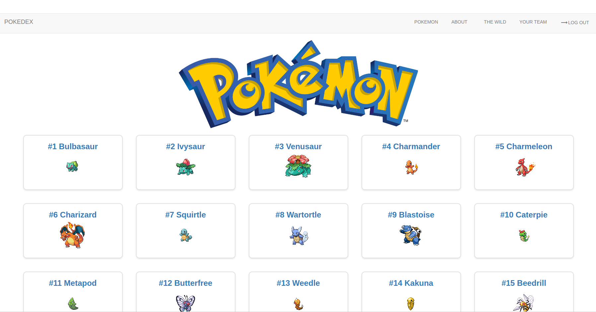
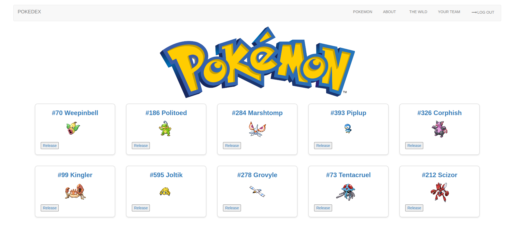
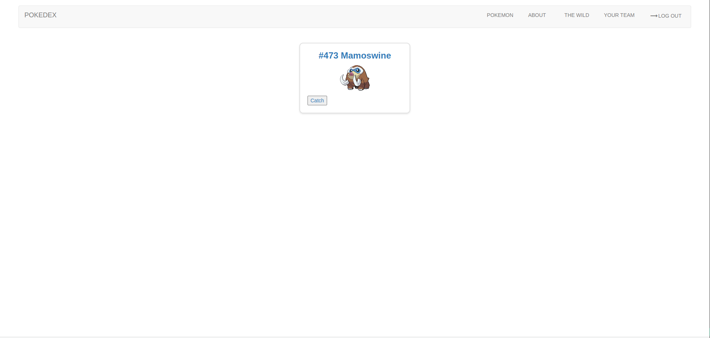

# **Pokemon Adventures 1.0**

## General Overview

Pokemon Adventures (a.k.a. The Pokedex app) is a single-player adventure game in which players have access upon login to every single pokemon across all different regions. Users can catch and release pokemon as they please.

The Pokedex app is a popular mobile application that provides information about various Pokemon characters from the popular Pokemon franchise. 

It allows users to browse and search for information on different Pokemon characters such as their types, abilities, moves, and statistics. 

The app also includes a list of all the Pokemon characters along with their pictures and detailed descriptions. With the Pokedex app, 

Pokemon fans can easily keep track of their favorite characters, learn new things about them, and discover new Pokemon characters that they may not have known about before. 

Overall, the Pokedex app is a useful tool for Pokemon enthusiasts who want to expand their knowledge about the Pokemon universe.

## Screenshots

)
)

## Technologies Used

- Express.js
- Node.js
- Google Oauth
- PokeAPI
- EJS
- CSS
- Bootstrap
- Vanilla JavaScript

## Play the Game

The game has not been deployed as of yet.

## Future Work

- **Add Leveling Up and Battle Feature**: Pokemon have a myriad of information stored including the level and some battle attacks. It's not much of a stretch to include a battle feature where pokemon appear in the wild and pokemon in your team can level up.
- **Gym Battles**: Adding gym battles where not only users can earn badges, but they can also qualify for the indigo plateau and train their team.
- **Evolution**: This one's a bit tricky as the current PokeAPI does not contain information regarding when a pokemon evolves and their next evolved form. I would have to include this information myself and add some logic to get evolutions underway.
- **SocketIO**: Allowing battles across different users would be a nice long-term goal to achieve.